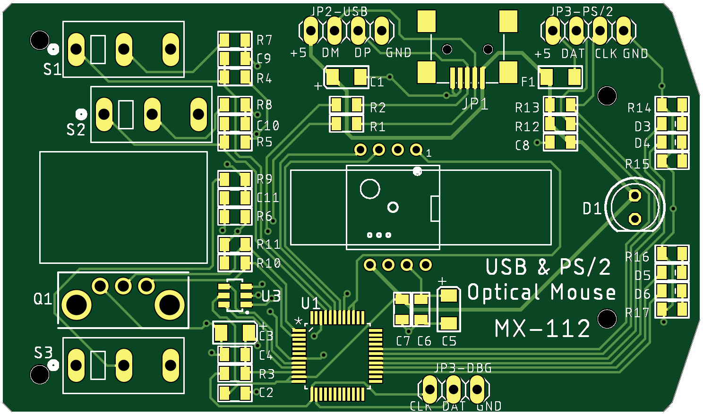

# Mouse MX-112 - Free computer mouse with USB and PS/2 interfaces

This is a computer mouse witj USB and PS/2 intefaces, with 3 buttons and a wheel. The PCB is designed to be places in a cheap plastic case manufactured in china. I have used plastic case from RX-112 mouse as a donor.

The mouse is compatible with Windows and Linus OS.

The device is based on a Silabs 8-bit MCU [EFM8UB20F32](https://www.silabs.com/mcu/8-bit/efm8-universal-bee/device.efm8ub20f32g-qfp32). This MCU has Fullspeed USB controller and adjustable internal oscillator.

### Advantages of this mouse:
* Open hardware and software design;
* Compliant to hardware and software specification;
* All electronic components are available in your local shop;
* I use it myself.

The [`Hardware`](Hardware) folder contains Eagle CAD 9 schematics files. The board schematics can be found in the[`Hardware/Mouse-112-sh.png`](Hardware/Mouse-112-sh.png) file.

The firmware is under development..

##### Some pictures of this Mouse MX-112:cool:

### TODO :pen:
- [] Solder;
- [] Test hardware;
- [] Write firmware;
- [] Test firmware;
- [] Find a sponsor :smile:

[GitHub readme tips&tricks](https://help.github.com/articles/basic-writing-and-formatting-syntax/)
